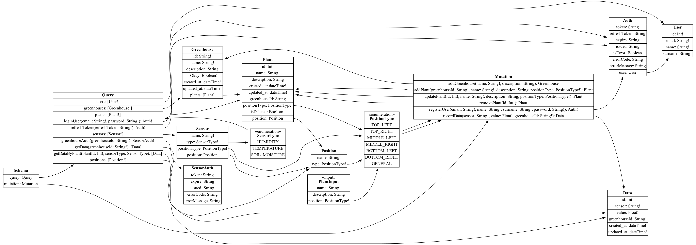
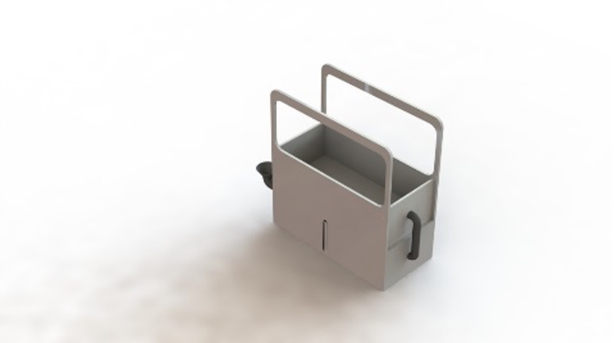
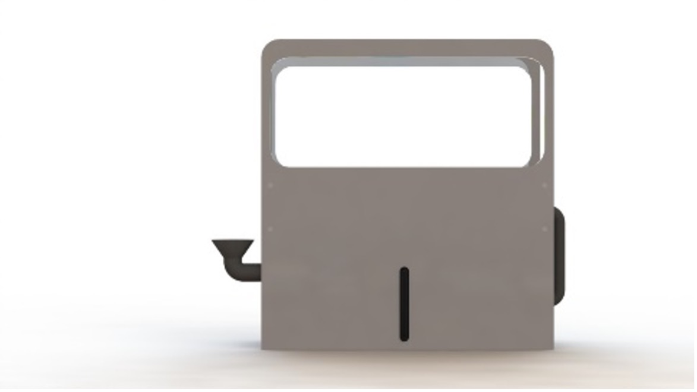
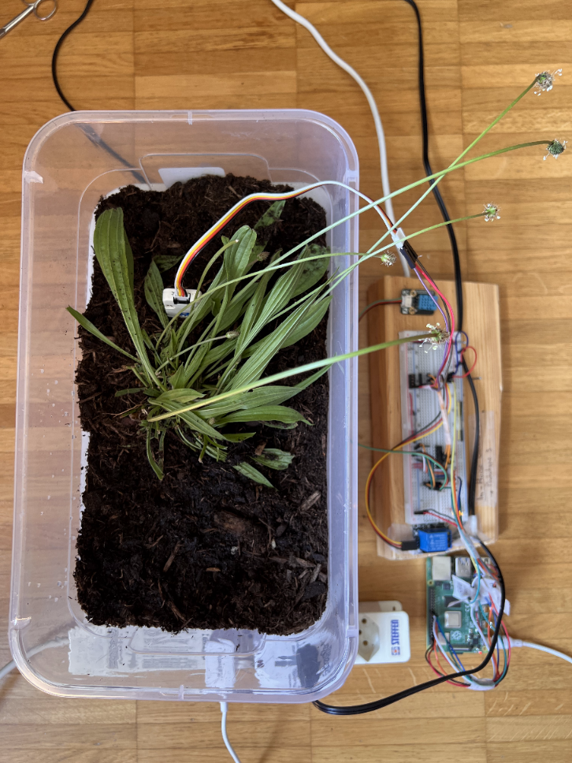
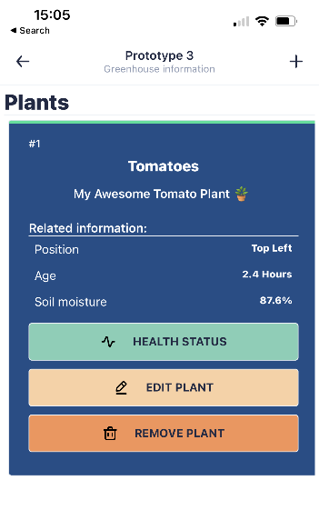

# In-House Greenhouse - A new generation of smart greenhouses<!-- omit in toc -->

<p align="center">
  
</p>

https://user-images.githubusercontent.com/37295664/169318002-b878eddd-9390-4225-afca-91f329b1f64c.mp4

## Table of Contents<!-- omit in toc -->

- [1. Problem description](#1-problem-description)
- [2. Our solution](#2-our-solution)
- [3. System architecture](#3-system-architecture)
- [4. Infrastructure](#4-infrastructure)
  - [4.1. Tech Stack](#41-tech-stack)
  - [4.2. In-House Greenhouse App](#42-in-house-greenhouse-app)
  - [4.3. In-House Greenhouse IoT](#43-in-house-greenhouse-iot)
  - [4.4. In-House Greenhouse Server](#44-in-house-greenhouse-server)
  - [4.5. In-House Greenhouse Database](#45-in-house-greenhouse-database)
- [5. Circuit Diagram](#5-circuit-diagram)
- [6. Development](#6-development)
  - [6.1. Database](#61-database)
  - [6.2. Server and APIs](#62-server-and-apis)
    - [6.2.1. Building queries](#621-building-queries)
    - [6.2.2. Config file](#622-config-file)
    - [6.2.3. Authentication](#623-authentication)
  - [6.3. Mobile app](#63-mobile-app)
  - [6.4. GreenProxy](#64-greenproxy)
  - [6.5. GreenCore](#65-greencore)
- [7. 3D renderings](#7-3d-renderings)
- [8. Working prototype](#8-working-prototype)
- [9. Directory structures](#9-directory-structures)
  - [9.1. Project directory structure](#91-project-directory-structure)
  - [9.2. Greenhouse app directory structure](#92-greenhouse-app-directory-structure)
  - [9.3. Greenhouse API server directory structure](#93-greenhouse-api-server-directory-structure)
  - [9.4. Greenhouse IoT file structure](#94-greenhouse-iot-file-structure)
- [10. Links to project resources](#10-links-to-project-resources)
- [11. Partners and sponsors](#11-partners-and-sponsors)

## 1. Problem description

The use of agricultural fields is fundamental for the production of primary goods necessary for human beings, but this involves numerous carbon emissions used in the transport of the goods to department stores or shops. These carbon emissions are then released into the air in the form of greenhouse gases through transportation. Like many other human activities, these emissions contribute to global warming.

## 2. Our solution

_In-House Greenhouse_ lets you control your smart greenhouse via your smartphone from anywhere in the world. You'll never have to ask a friend to water your plants again! This smart greenhouse allows you to fully manage up to 6 plants, providing water and collecting valuable information, such as soil moisture and air temperature. The collected data is used to generate statistics on your plant's growth and to alert you in case of any issues with one or more plants in your _in-house greenhouse_. You can also share this data with friends, allowing you to compare statistics.

## 3. System architecture


This diagram provides an overview of the components that constitute the _In-House Greenhouse_ system. The greenhouse collects data regarding plant conditions and the surrounding environment through sensors. This data is then transmitted to the server using HTTP calls to the API, where it is stored in a PostgreSQL database.

The phone application relies heavily on the API for its functionality. Data displayed in various interfaces, including the list of added greenhouses and statistics for different plants, is fetched dynamically through HTTP requests sent to the API. Users, through the phone application, can not only view but also modify this data. They have the ability to edit information for any greenhouse and any plant owned by the user.

The heart of the application, the APIs, runs within a Docker container, including the database to which they are connected. Utilizing containers provides several advantages, notably the ability to scale up the number of API containers dynamically when the primary container experiences high load. Docker-Compose simplifies the process of launching the entire application on any platform, requiring no additional configuration.

## 4. Infrastructure

This chapter describes each component present in the system, delving into the technologies and languages used for their development.

### 4.1. Tech Stack

<table>
  <tr>
    <td>
      <p align="center">
        In-House Greenhouse IoT
      </p>
    </td>
    <td>
      <ul>
        <li>Raspberry Pi 3 Model B+</li>
        <li>Java + Pi4J</li>
        <li>Sensors (soil moisture, temperature, humidity and water level sensor)</li>
      </ul>
    </td>
  </tr>
  <tr>
    <td>
      <p align="center">
        In-House Greenhouse App
      </p>
    </td>
    <td>
      <ul>
        <li>React Native + Expo</li>
        <li>UI Kitten</li>
        <li>MobX-State-Tree</li>
        <li>TypeScript</li>
      </ul>
    </td>
  </tr>
  <tr>
    <td>
      <p align="center">
        In-House Greenhouse Server
      </p>
    </td>
    <td>
      <ul>
        <li>Apollo Server</li>
        <li>GraphQL + GraphQL Nexus</li>
        <li>Prisma ORM</li>
        <li>TypeScript</li>
        <li>Docker container</li>
      </ul>
    </td>
  </tr>
  <tr>
    <td>
      <p align="center">
        In-House Greenhouse Database
      </p>
    </td>
    <td>
      <ul>
        <li>PostgreSQL DataBase</li>
        <li>Docker container</li>
      </ul>
    </td>
  </tr>
</table>

### 4.2. In-House Greenhouse App

The application is developed with React Native and Expo using TypeScript. To simplify the development of the application views, the app uses *Ui Kitten* as the UI framework.

### 4.3. In-House Greenhouse IoT

The software behind the physical IoT greenhouse allows it to be managed autonomously. Its software, which has been named "GreenCore," enables the greenhouse to autonomously handle both the configuration part (at the first power-up, a greenhouse must be registered within the system via API). It has been entirely implemented in Java, employing parallel programming techniques to optimize sensor reading processes. Furthermore, the Pi4J library (version 1.4, [link](https://pi4j.com/1.4)) is used to control the GPIO pins of the Raspberry Pi 3 Model B+.

The greenhouse features the following sensors:

- 6 soil moisture sensors to collect soil data from plants
- 1 water level sensor that monitors the water tank level
- 1 air temperature sensor
- 1 air humidity sensor

The data generated by the sensors is made available through the smartphone application via special APIs that handle data storage within the database.

### 4.4. In-House Greenhouse Server

The API server is managed using the *GraphQL* query language. The use of this particular query language allows developers to request only the necessary data from the API, thus avoiding unnecessary network traffic and expensive queries. The API manages every aspect of the system; in fact, it's only through the API that data can be read and written to the database. The API server is the only component of the system that can connect directly to the database and query it.

For API communication, it's mandatory to use HTTP POST requests with the GraphQL query contained in the request body. For more information on creating these queries, you can consult the official guide: [GraphQL Queries Guide](https://graphql.org/learn/queries/).

The entire system was developed through Apollo Server ([link](https://www.apollographql.com)), a suite that combines the well-known back-end framework ExpressJS with the fantastic query language GraphQL. To further facilitate database development, the Prisma ORM ([link](https://www.prisma.io)) is used. This framework allows you to describe the database structure in textual form (a so-called "schema") and, through an operation called "migration," transform it into SQL commands that are executed automatically inside the PostgreSQL server, applying schema changes automatically to the various tables.

### 4.5. In-House Greenhouse Database

The database is a simple PostgreSQL server and is managed autonomously through a Docker container (managed with docker-compose, [Docker Compose Reference](https://docs.docker.com/compose/reference)) using the following image: *postgres:11.10*. Through the configuration file related to docker-compose (*docker-compose.yml*), you can modify several essential parameters, such as the username and password, or the name of the database created by default at startup.

## 5. Circuit Diagram

This is the circuit diagram of the physical system, illustrating how various components are interconnected:


For the full-size version of the circuit diagram, click [here](/extra/schematics/Schematic_InHouseGreenhouse.pdf).

## 6. Development

### 6.1. Database

The database is implemented using PostgreSQL and is hosted on a Docker container. It is connected to the API using the Prisma ORM. Here's the database ER diagram:


Every table in the database is defined in the Prisma schema. You can find the schema definition in this [file](./greenhouse-server/prisma/schema.prisma).

A notable feature of this database is that plant data is never completely deleted but is only hidden by setting the *isDeleted* flag to "true."

### 6.2. Server and APIs

The API server serves as the core of In-House Greenhouse. As mentioned earlier, the server was developed using Apollo Server (a web server) with GraphQL (an API query language) and Nexus GraphQL (a schema generator). The API server utilizes the Prisma ORM database to handle queries and database modifications.

APIs are categorized into two primary groups:

1. **Queries**: This group includes APIs that retrieve data from the database without making any modifications.

2. **Mutations**: In this group, you'll find APIs that are responsible for modifying data, including operations like deletion, modification, and insertion.

Below is a diagram illustrating the structure of the GraphQL API:



#### 6.2.1. Building Queries

For the development of various queries, the server provides a Sandbox for testing, accessible via the loopback address: [http://localhost:4000](http://localhost:4000).

#### 6.2.2. Config File

You can adjust server settings via the `.env` configuration file.

Here's a list of all available settings:

| Name                        | Description                                             |
| --------------------------- | ------------------------------------------------------- |
| DATABASE_URL                | URL required for the database connection.              |
| JWT_ACCESS_TOKEN_SECRET     | Secret key needed for JWT access token encryption (valid for 30 minutes). |
| JWT_REFRESH_TOKEN_SECRET    | Secret key needed for JWT refresh token encryption (valid for 7 days).    |
| JWT_GREENHOUSE_TOKEN_SECRET | Secret key needed for JWT greenhouse token encryption (valid for 1 minute). |
| API_SERVER_PORT              | Port where the APIs are accessible.                    |
| API_SERVER_URL               | Host where the APIs are accessible.                    |

#### 6.2.3. Authentication

The API server employs three types of tokens for authentication:

1. **Access token**: Provides access to the API, with a **validity of 30 minutes**. This token grants access to all APIs.

2. **Refresh token**: Allows for the renewal of the access token, with a **validity of 7 days**. This token serves no other purpose and cannot be used to access APIs.

3. **Greenhouse token**: An access token used by the IoT greenhouse to record data, with a **validity of 1 minute**. This token can only be used in the API related to the IoT greenhouse, specifically the one for recording data in the system (Mutation:recordData) and the one for retrieving recorded sensor data (Query:getSensors).

Here's a simple diagram illustrating the authentication process between the API server and the IoT greenhouse/Smartphone application:

1. Application requests access from the API server


2. Greenhouse IoT device requests access from the API server


### 6.3. Mobile App

The application initially presents a login/registration screen, which allows you to access the system. This authentication process is strictly necessary since the user needs the access and refresh tokens to make calls to the API (see Chapter **6.2.3 Authentication**).


Once logged in, the application shows the homepage, where you can view all the greenhouses managed by the user. When you select a greenhouse, the application shows a summary screen displaying all the plants in that greenhouse. This is a screenshot:


Plants can be added using the appropriate button at the top right (symbol "+") or modified by tapping on the "Edit Plant" button inside the plant card.


You can view the statistics of a specific plant by tapping on the "Health Status" button inside the plant card. If the plant has not yet received any data, the system will show a warning message; otherwise, it will display a summary of the statistics.


You can navigate the app via a drawer on the left, which can be opened either by swiping to the right or by clicking the hamburger icon on the homepage.


Note: In this chapter, I have shown only the most important screens, so there are no screenshots of every interface present.

### 6.4. GreenProxy

GreenProxy is an application written in Go (https://go.dev), which allows you to manage the communication between Greenhouse IoT and the API server. The greenhouse, when it has to perform a request to the API, sends it to GreenProxy, which manages the authentication (request of the greenhouse token) and the communication with the API server (sends the GraphQL query to the API server and returns the response to the sender).

This is an example of GreenProxy's output, showing the startup process (where the config file is loaded) and the request forwarding process (with its authentication):


GreenProxy is used within a Docker container to run the application in isolation from the rest of the application. You can activate the proxy via the command `docker-compose up`.

### 6.5. GreenCore

GreenCore is the software that manages the IoT greenhouse. The system has been programmed as a state machine, where, in order to proceed to the next state, the current state must be successfully terminated. Each state is called a "Sequence" and is defined by a class that extends the *ISequence* interface. The system uses three states:

1. **SplashScreen Sequence**

In this sequence, a splash screen is printed on the terminal, showing the title of the application (GreenCore) and its authors.


2. **Setup Sequence**

During the setup sequence, the greenhouse tries to detect if it has already been configured. If it has been configured, there is a configuration file that keeps the UUID of the device, the name, and its description if present. If it has already been configured, it proceeds to the next state (*Startup Sequence*). Otherwise, a WebSocket is opened, allowing the greenhouse to receive its configuration from the user. The configuration is sent in JSON format and must have this format:

```JSON
{
  "token": "<USER ACCESS TOKEN>",
  "name": "<GREENHOUSE NAME>",
  "description": "[OPTIONAL DESCRIPTION]"
}
```

Note: For security reasons, it is necessary to send an access token (the same one the user uses to make requests to the API from the app) to access the greenhouse creation API (Mutation:addGreenhouse).

If the data submitted by the user is valid, the greenhouse announces itself to the API server, sending its name and description. If the creation is successful, the API will send the greenhouse its UUID, which will be used to request the _greenhouse token_ (see _Chapter 5.2.3 Authentication_). If, on the other hand, the configuration provided is invalid, the greenhouse will send the user an error message notifying them of the problem.

3. **Startup sequence**

The startup sequence is the operational state of the greenhouse. During this sequence, the greenhouse dynamically loads sensors and their identifying names directly from the API (Query::getSensors). Next, it assigns each sensor to a separate thread, managed by the **MonitoringOrchestrator** class. This orchestrator manages the pool of threads, handling their startup and possible problems generated. If a thread breaks, the orchestrator will try to restart it automatically to avoid unwanted problems.


The monitoring settings are defined by a **MonitoringConfig** object, which provides the following fields:

| Name | Usage |
| -----| ------|
| `greenhouse` | Greenhouse object that represents the current greenhouse |
| `timeBetweenChecks` | Milliseconds between sensor readings |

## 7. 3D Renderings

The following render images show the design of the In-House Greenhouse:

- Isometric View

  

- Side View

  

- Top View

  
  
> Credits: Danny Nguyen, Penn State student

## 8. Working prototype





## 9. Directory structures

### 9.1. Project directory structure

```text
.
└── in-house-greenhouse/
    ├── greenhouse-app    # Greenhouse App
    ├── greenhouse-server # Greenhouse API server
    └── greenhouse-iot/   # Greenhouse IoT files
        ├── GreenCore     # GreenCore
        ├── GreenProxy    # GreenProxy
        └── UPnP          # UPnP discovery (UNUSED)
```

### 9.2. Greenhouse app directory structure

```text
greenhouse-app/
├── app/
│   ├── assets/      # App assets
│   ├── components/  # React native components
│   ├── config/      # Config file loader (DO NOT TOUCH!)
│   ├── i18n/        # Multi-Language 
│   ├── models/      # MobX State Tree data models
│   ├── navigators/  # App navigators (Stack, Drawer, Bottom Tab)
│   ├── screens/     # App screens
│   ├── services/
│   │   ├── api/
│   │   │   ├── core/            # API library core 
│   │   │   ├── authentication/  # Authentication API service
│   │   │   ├── data/            # Data API service
│   │   │   ├── greenhouse/      # Greenhouse API service
│   │   │   ├── plant/           # Plant API service
│   │   │   └── position/        # Position API service
│   │   ├── keychain/            # KeyChain credentails service
│   │   └── reactotron/          # Reactotron service (DO NOT TOUCH!)
│   ├── theme/
│   ├── utils/
│   └── app.tsx
├── e2e/             # Detox End-To-End Testing
└── test/            # Boilerplate default tests
```

### 9.3. Greenhouse API server directory structure

```text
greenhouse-server/
├── extra/
│   ├── db/              # Database ER diagram
│   └── graphql/         # GraphQL API diagram
├── prisma/
│   ├── ...
│   ├── schema.prisma    # Prisma schema
│   └── seed.ts          # Prisma database seeder
└── src/
    ├── api/             # GraphQL APIs
    ├── utils/
    │   ├── env/
    │   │   └── env.ts             # Environment loader utility class
    │   ├── jwt/
    │   │   └── jwt.ts             # JWT token utility class
    │   └── request/
    │       └── authentication.ts  # Requests utility class
    └── server.ts         # !API server entry point!
```

### 9.4. Greenhouse IoT file structure

> The file structure for the Greenhouse IoT files is too extensive to be described here. You can find it in the repository by clicking [here](./greenhouse-iot).
In addition, here you can find the GreenCore [JavaDoc](https://lucadibello.github.io/in-house-greenhouse/).

## 10. Links to project resources

Links to each of the following project resources:

- [GreenCore]( ./greenhouse-iot/GreenCore/)
  - [GreenCore Docs](https://lucadibello.github.io/in-house-greenhouse/)
- [GreenProxy](./greenhouse-iot/GreenProxy/)
- [UPnP](./greenhouse-iot/UPnP/)
- [Greenhouse App](./greenhouse-app/)
- [Greenhouse API Server](./greenhouse-server/)

## 11. Partners and sponsors

<p align="middle">
  
   
</p>

This project was the result of collaboration with [SUPSI](https://www.supsi.ch/dti) (University of Applied Sciences of Southern Switzerland) and [Penn State University](https://www.psu.edu). We express our gratitude for this opportunity.
